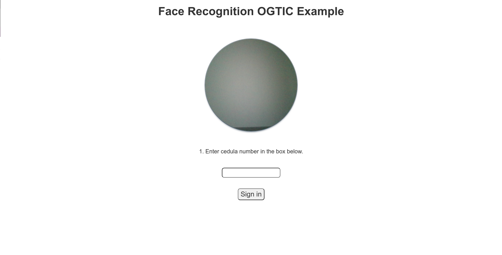

<p>Facial Authentication is an API for verifying the user identity through the liveness detection process and comparing the Document ID photo with their faces.</p>

<h1 align="center">Face Authentication API</h1>
<!-- <p align="center"></p> -->

## Getting started

To authenticate a user you need to make a request to `GET /verify` sending the cedula and a short video (the video should be not more then 5 seconds) of the face of the user:

```shell
curl -i -H 'Content-Type: application/json' -d="cedula=${CEDULA_NUMBER}&source=data:video/webm;base64,${VIDEO_BASE64}"  http://{ENDPOINT}/verify
```

Also you can open a web demo going to  `https://{ENDPOINT}/`:



## Install

environment variables

```shell
# Optional env
PORT=80
HOST="0.0.0.0"
REDIS_HOST='localhost'
REDIS_PORT=6379

# Require
CEDULA_API_KEY=...
FACE_API_KEY=...
FACE_API_ENDPOINT=...
```

To install it using docker with docker-compose:

```shell
git clone git@github.com:opticrd/facial-auth-api.git
cd facial-auth-api
docker-compose up
```

To install it manually (python 3.6+ and pip should be installed):

```shell
# Deploy redis for json support
 docker run -p 6379:6379 --name redis-redisjson redislabs/rejson:latest

#
git clone git@github.com:opticrd/facial-auth-api.git
cd facial-auth-api
pip install -r requirements.txt
uvicorn src.api:app
```

## Authors

* [Eddy Decena](https://github.com/eddynelson)